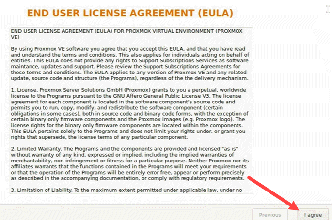

# <div align="center">**ProxMox for Newbie**</div>

Una semplice guida (ITA-ENG) per nabbazzi come me! giusto per tenere  a portata comandi e nozioni! se ho scritto cazzate sentitevi liberi di commentare e aprire issue a gogo e anche di insultarmi!


# SOMMARIO

<details>
  <summary>CONTENUTI</summary>
  <ol>
    <li>
      <a href="#setupbios">SETUP INIZIALE - BIOS</a>
      <ul>
        <li><a href="#bios">BIOS</a></li>
        <li><a href="#installazione">INSTALLAZIONE</a></li>
        <li><a href="#first-login">FIRST LOGIN</a></li>
        <li><a href="#uefi-bootloader">UEFI BOOTLOADER</a></li>
      </ul>
    </li>
    <li>
      <a href="#post-setup">POST SETUP</a>
      <ul>
        <li><a href="#repository">REPOSITORY</a></li>
        <li><a href="#eliminare-popup-no-subscription">NO POPUP SUBSCRIPTION</a></li>
        <li><a href="#partitioning">PARTITIONING</a></li>
        <li><a href="#isos">UPLOAD ISOs</a></li>
      </ul>
    </li>
    <li><a href="#pci-passthrough">PCI PASSTHROUGH</a></li>
  </ol>
</details>


# SETUP/BIOS:

### BIOS:
prima di partire con l'installazione vera e propria di PROXMOX assicuriamoci di mettere l'impostazione UEFI nel BIOS:

> [!IMPORTANT]
> è assolutamente importante DISABILITARE  dal BIOS anche l'impostazione SECURE BOOT e CSM/Legacy

alcune immagini esempio di queste impostazioni (potrebbero variare in base alla scheda madre in quanto posizione, tendenzialmente si troveranno sulla scheda BOOT)
<details>
  <summary>IMMAGINI BIOS</summary>
 
 
 </details>


Fatto questo il nostro sistema ProxMox verrà installato senza problemi in modalità UEFI.
> [!IMPORTANT]
> Ovviamente formattando il pennino USB in modalità GPT UEFI con un tool come Rufus!
<a title="RUFUS" href="https://rufus.ie/it/">RUFUS LINK</a>

### INSTALLAZIONE:

Cominciamo quindi inserendo il pennino usb precedentemente formattato e avviamolo.
Seguiranno una serie di immagini esempio del processo di installazione:
<details>
  <summary>IMMAGINI SETUP INIZIALE</summary>
 
 
 
 
 </details>

 dopo il riavvio vi ritroverete su una schermata nera con il login, a noi interesserà soltanto segnarci l'indirizzo IP per poter entrare nella WebUI da un altro pc in rete tramite browser:
 


### FIRST LOGIN
Adesso potremo loggare sia tramite webUI andando su 
```
https://162.198.51.2:8006/
```
oppure tramite ssh con
```
ssh root@162.198.51.2
```
> [!NOTE]
> La password ovviamente sarà quella impostata durante il setup iniziale!

> [!TIP]
> Io vi consiglio di entrare direttamente da WebUI (se potete), anche perché sarà possibile avviare la shell direttamente da lì e gestire tutte le funzioni di proxmox da lì è più semplice e intuitivo. Ovviamente si può fare anche tutto da terminale!
 
 

> [!IMPORTANT]
> Fate attenzione poiché la webUI gira su protocollo HTTPS quindi non appena visiterete la pagina vi darà l'errore che la pagina non sarà sicura poiché è una certificazione non registrata e quindi non presente nei database, più avanti farò una guida anche per fixare questa situazione. Per ora basterà skippare questo advise e proseguire normalmente.
 


### UEFI BOOTLOADER:
Una volta fatto il Login potremo fare un check per assicurarci che sia effettivamente tutto sistemato e funzionante in UEFI, daremo quindi questo comando dalla shell:

```
efibootmgr -v
```


se l'output del comando darà una cosa del genere allora il bootloader (GRUB) starà utilizando la modalità UEFI:
> Boot0005* proxmox       [...] File(\EFI\proxmox\grubx64.efi)

se nell'output uscirà invece "systemd-boot" allora sarà SystemD-Boot il bootloader e non GRUB (ma sempre in UEFI mode) .
> Boot0006* Linux Boot Manager    [...] File(\EFI\systemd\systemd-bootx64.efi)

Se dovesse comparire qualcosa come questo output
> Boot0002* proxmox	[...] File(\EFI\PROXMOX\SHIMX64.EFI)

sarà comunque in UEFI ma utilizzerà SHIMX64 invece di GRUB che è il "validatore" per avviare GRUB nel caso in cui dovesse essere attivo SECURE BOOT. 

> [!NOTE]
> Stranamente da me è rimasto comunque impostato SHIMX anche se Secure Boot è disabilitato. Non è un problema, partirà comunque GRUB. Volendo si può cambiare la entry boot andando nel bios e modificando il file (se il vostro bios vi permette di farlo, se no andrebbe fatto da UEFI SHELL che è un po' più complesso e se ci sarà tempo farò una breve guida per giocare anche con quel tool)

> [!NOTE]
> Una cosa che mi ha fatto tribolare inizialmente! Il fatto che vedrete GRUB come bootloader non vorrà dire che il sistema sarà in modalità LEGACY!!
Per distinguere quale dei 2 bootloader è utilizzato basterà mandare il comando di prima e leggere l'output ma già dalla parte estetica sarà possibile riconoscerli.
GRUB è GRUB, schermata blu con la scritta GRUB in alto (vedi foto)

Systemd-Boot è riconoscibile da una schermata nera molto semplice con 1 o 2 righe al centro selezionabili. (vedi foto)


> [!NOTE]
> Eventualmente potrete anche fare un check per capire se siete in modalità UEFI (indipendentemente dal bootloader) controllando se la cartella /sys/firmware/efi è vuota o se non esiste proprio. (ovviamente se siete in UEFI sarà popolata da file e cartelle)


# POST-SETUP:

Se è presente una vecchia installazione di Proxmox nel tuo sistema (magari installato su un altro hard disk), ti sarà stato chiesto durante l'ultima installazione di rinominare la vecchia PVE in "pve-old"

Andiamo quindi a rimuoverla:
Nella webUI di Proxmox facciamo il login e andiamo sotto DATACENTER a poi su "DISKS - LVM", cerchiamo lì il nome PVE-OLD per intero e prendiamone nota (ex: PVE-OLD-6049DC)

IMMAGINE

nella shell di comando di proxmox (o in ssh) mandiamo questi comandi:
```
lvremove PVE-OLD-6049DC
```
e confermiamo con Y

dopo aver fatto questo potremo WIPPARE il vecchio disk utilizzato dalla sezione DISKs sulla GUI

IMMAGINE

### REPOSITORY
Dobbiamo cambiare la repository da Enterprise a No-Enterprise (non avendo un abbonamento con proxmox)
andiamo sulla GUI nella sezione REPOSITORIES e selezioniamo ADD e scegliamo dall'elenco "No-Subscription"

IMMAGINE

non dimenticate di selezionare e disabilitare la repository ENTERPRISE già presente dalla lista.

IMMAGINE 


adesso o dalla gui di proxmox sempre su REPOSITORY o tramite terminale con APT UPDATE && APT UPGRADE potrete aggiornare le repo e i pacchetti.
IMMAGINE WEB
IMMAGINE SHELL


### ELIMINARE POPUP “NO SUBSCRIPTION”
Come avrete notato dal primo login, non avendo la SUBSCRIPTION a Proxmox, ci comparirà in continuaizone questo popup come reminder che è molto seccante.

IMMAGINE

Procediamo con la rimozione che adesso è ancora più semplice grazie ad un solo comando che fa tutto lui, andando a modificare una piccola sezione all'interno di un file javascript che gestisce questa parte della WEBUI.
Basterà mandare questo comando qui sotto e il gioco è fatto:

```
sed -Ezi.bak "s/(Ext.Msg.show\(\{\s+title: gettext\('No valid sub)/void\(\{ \/\/\1/g" /usr/share/javascript/proxmox-widget-toolkit/proxmoxlib.js && systemctl restart pveproxy.service
```

### PARTITIONING
E' consigliato anche estendere la partizione PVE BOOT rimuovendo quella data (praticamente lasciando una singola partizione)

IMMAGINE

estendiamo LVM PVE BOOT SPACE con questi comandi:
```
lvremove /dev/pve/data
```
confirm
```
lvresize -l +100%FREE /dev/pve/root
```
```
resize2fs /dev/mapper/pve-root
```

Adesso potrete anche rimuovere la souce storage local-lvm dalla gui andando su:
Datacenter - Storage - "local-lvm" 
IMMAGINE

REBOOT


### ISOs:
Adesso, andando su "local (proxmox)", sentitevi liberi di caricare tutte le immagini ISO nella sezione "ISO IMAGES" utilizzando il tasto UPLOAD or Download from URL"
IMMAGINE


# PCI PASSTHROUGH:


<details>
  <summary>testo</summary>
ex:

# Titolo H1
## Titolo H2
### Titolo H3
#### Titolo H4
##### Titolo H5

align="left" or "right"</details>

> [!NOTE]
> Useful information that users should know, even when skimming content.

> [!TIP]
> Helpful advice for doing things better or more easily.

> [!IMPORTANT]
> Key information users need to know to achieve their goal.

> [!WARNING]
> Urgent info that needs immediate user attention to avoid problems.

> [!CAUTION]
> Advises about risks or negative outcomes of certain actions.

<p align="center">
  
</p>

> efibootmgr -v
> *efibootmgr -v*
> **efibootmgr -v**
`efibootmgr -v`
<kbd>efibootmgr -v</kbd>