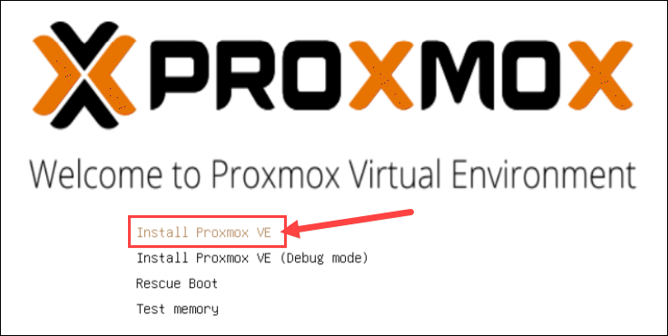

# <div align="center">**ProxMox for Newbie**</div>

Una semplice guida (ITA-ENG) per nabbazzi come me! giusto per tenere  a portata comandi e nozioni! se ho scritto cazzate sentitevi liberi di commentare e aprire issue a gogo e anche di insultarmi!


# SOMMARIO
**CONTENUTI**

- [**SETUP INIZIALE - BIOS**](#setupbios)


## SETUP/BIOS:
prima di partire con l'installazione vera e propria di PROXMOX assicuriamoci di mettere l'impostazione UEFI nel BIOS:

> [!IMPORTANT]
> è assolutamente importante DISABILITARE  dal BIOS anche l'impostazione SECURE BOOT e CSM/Legacy

alcune immagini esempio di queste impostazioni (potrebbero variare in base alla scheda madre in quanto pozione ma tendenzialmente si troveranno sulla scheda BOOT)
<details>
  <summary>IMMAGINI</summary>
 
 
 </details>


Fatto questo il nostro sistema ProxMox verrà installato senza problemi in modalità UEFI.

Cominciamo quindi inserendo il pennino usb precedentemente formattato (io uso Rufus per formattarlo e metterci sopra la ISO di Proxmox)
e avviamolo, seguiranno una serie di immagini esempio del processo di installazione:
<details>
  <summary>IMMAGINI</summary>
 
 
 
 
 </details>

 dopo il riavvio vi ritroverete su una schermata nera con il login, a noi interesserà soltanto segnarci l'indirizzo IP per poter entrare nella WebUI da un altro pc in rete tramite browser:
 


Volendo fare un check per assicurarci che sia effettivamente così potremmo dare questo comando dalla shell:


```
efibootmgr -v
```


se l'output del comando darà una cosa del genere allora il bootloader (GRUB) starà utilizando la modalità UEFI:
> Boot0005* proxmox       [...] File(\EFI\proxmox\grubx64.efi)

se nell'output uscirà invece "systemd-boot" allora sarà SystemD-Boot il bootloader e non GRUB (ma sempre in UEFI mode) .
> Boot0006* Linux Boot Manager    [...] File(\EFI\systemd\systemd-bootx64.efi)

> [!NOTE]
> Una cosa che mi ha fatto tribolare inizialmente! Il fatto che vedrete GRUB come bootloader non vorrà dire che il sistema sarà in modalità LEGACY!!
Per distinguere quale dei 2 bootloader è utilizzato basterà mandare il comando di prima e leggere l'output ma già dalla parte estetica sarà possibile riconoscerli.
GRUB è GRUB, schermata blu con la scritta GRUB in alto (vedi foto)
> 
> Systemd-Boot è riconoscibile da una schermata nera molto semplice con 1 o 2 righe al centro selezionabili. (vedi foto)
> 


<details>
  <summary>testo</summary>
ex:
# Titolo H1
## Titolo H2
### Titolo H3
#### Titolo H4
##### Titolo H5
align="left" or "right"</details>

> [!NOTE]
> Useful information that users should know, even when skimming content.

> [!TIP]
> Helpful advice for doing things better or more easily.

> [!IMPORTANT]
> Key information users need to know to achieve their goal.

> [!WARNING]
> Urgent info that needs immediate user attention to avoid problems.

> [!CAUTION]
> Advises about risks or negative outcomes of certain actions.

<p align="center">
  
</p>

> efibootmgr -v
> *efibootmgr -v*
> **efibootmgr -v**
`efibootmgr -v`
<kbd>efibootmgr -v</kbd>